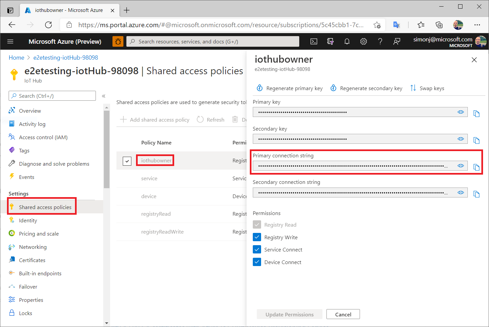
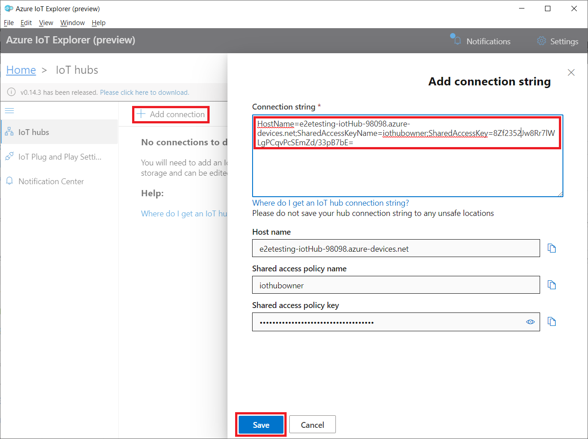
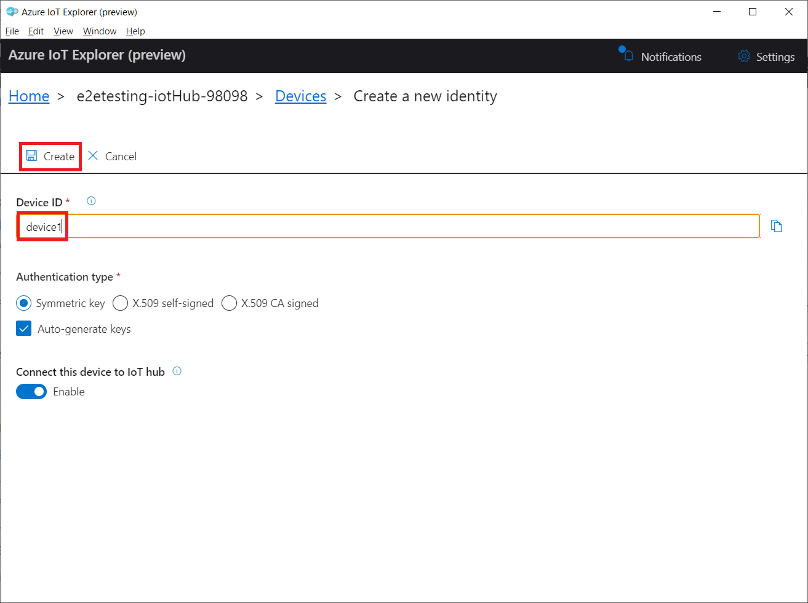
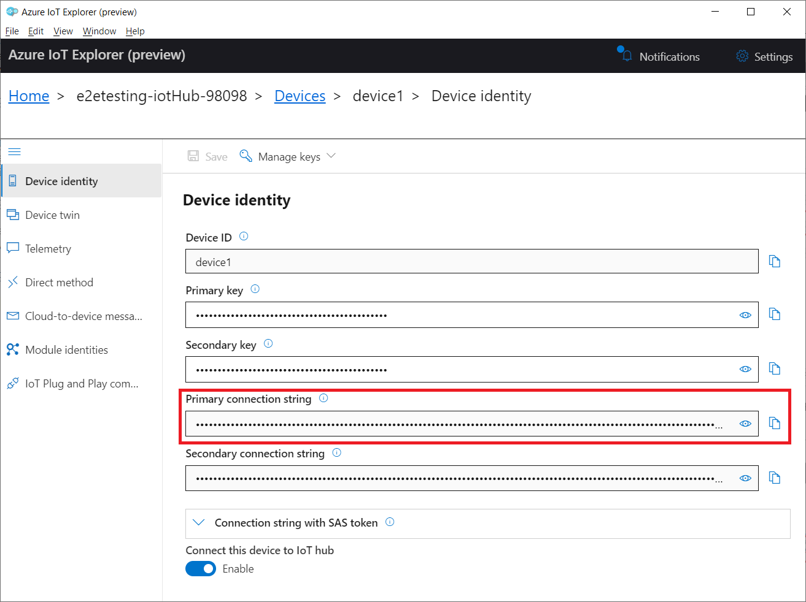
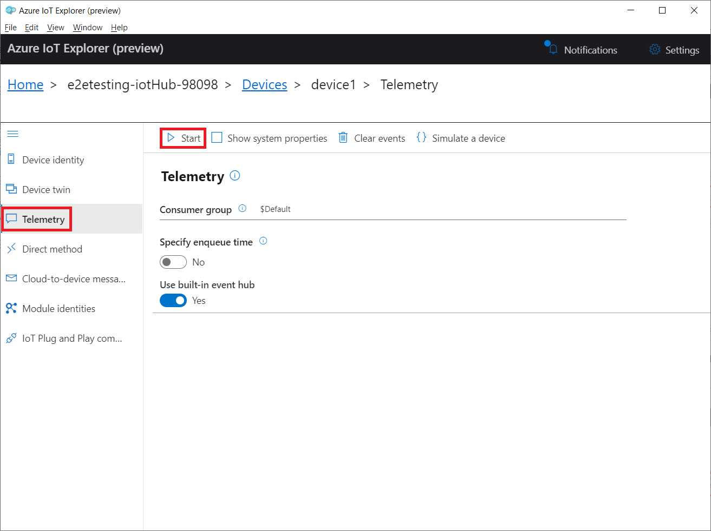

# OPC Publisher Events and Alarms Bug Bash

This document outlines some scenarios to run through for the bug bash of the events and alarms feature of the [OPC Publisher](https://github.com/Azure/Industrial-IoT/tree/feature/events-and-alarms). Note that the OPC Publisher and the scenarios may be verified differently. For example, by running the OPC Publisher from the source code, using Docker with the published images (as in this document), or using deployed modules to a device with Azure IoT Hub.

> Questions or troubles? Reach out to Simon Jäger or Peter Bryntesson. 

## Prerequisites

This section describes the required setup to run the OPC Publisher and observe its output during the bug bash. The following tools and resources are needed.

1. [Docker](https://docs.docker.com/) - To run containers such as the [OPC PLC](https://github.com/Azure-Samples/iot-edge-opc-plc) and [OPC Publisher](https://github.com/Azure/Industrial-IoT/tree/feature/events-and-alarms).
1. [Azure IoT Explorer](https://docs.microsoft.com/en-us/azure/iot-pnp/howto-use-iot-explorer) - To inspect the messages published in Azure IoT Hub. Preferably the latest version, 0.14.3.
1. [Azure IoT Hub](https://docs.microsoft.com/en-us/azure/iot-hub/about-iot-hub) - To publish messages from the OPC Publisher.

### Docker

1. Check that the Docker installation is working (optional). 

    ```bash
    docker run -d -p 80:80 docker/getting-started
    ```

1. Open your browser and go to *http://localhost:80/*. If the Docker installation is working, you should see the Docker documentation. 

1. Pull the latest version of the required images. The tags are not static and subject to updates. Subsequently, performing the next step and pulling the images regardless if done beforehand is recommended. Anonymous access is enabled.

    ```bash
    docker pull trumpfdev.azurecr.io/iotedge/opc-plc:1.2.6
    ```

    ```bash
    docker pull trumpfdev.azurecr.io/events-and-alarms/iotedge/opc-publisher:6d2a9924
    ```

### Azure IoT Explorer

1. Create an Azure IoT Hub and obtain an Azure IoT Hub connection string with sufficient permissions., such as the default policy iothubowner with all the permissions.

    

1. Launch [Azure IoT Explorer](https://docs.microsoft.com/en-us/azure/iot-pnp/howto-use-iot-explorer) and add a connection using the Azure IoT Hub connection string of the Azure IoT Hub. Accept the defaults.

    

1. Add a new device in the Azure IoT Hub using the Azure IoT Explorer. Give it an arbitrary name and accept the defaults.

    

1. Get the connection string of the new device from Azure IoT Hub with Azure IoT Explorer. The OPC Publisher uses the connection string of the device to publish messages.

    

1. Start listening to messages from the device with the Azure IoT explorer. Use the Azure IoT explorer to verify the published messages. The scenarios require only one device and setup in Azure IoT Hub and Azure IoT Explorer. The device is reusable.

    

## Scenario 1: Events

This scenario tests regular events from the OPC PLC with the OPC Publisher and the Azure IoT Hub. It selects four event fields in the *SelectClauses*, two of which are from a complex data type, and filters the events by type in the *WhereClause*.

1. Create a folder on your machine (e.g., *C:\Configurations*) for the OPC Publisher.

1. Download the configuration file [pn1.json](https://raw.githubusercontent.com/simonjaeger/opc-publisher-events-and-alarms-bug-bash/main/Configurations/pn1.json) and place it in the beforementioned folder. 
    
    > The endpoint in the configuration has been predefined for a Docker container. Because the OPC Publisher runs inside a container, it must go through a different DNS name to reach the host and the OPC PLC: *host.docker.internal*. For example, *opc.tcp://host.docker.internal:50000*. If you are using a different setup, please adjust the endpoint.

1. Start the OPC PLC with the simple events from the [quickstart sample](https://github.com/OPCFoundation/UA-.NETStandard-Samples/tree/master/Workshop/SimpleEvents) from OPC Foundation. Learn more [here](https://github.com/Azure-Samples/iot-edge-opc-plc/blob/master/README.md#simple-events).

    ```bash
    docker run --rm -it -p 50000:50000 --name opcplc trumpfdev.azurecr.io/iotedge/opc-plc:1.2.6 --pn=50000 --autoaccept --ses
    ```

1. Start the OPC Publisher with the connection string of the device in the Azure IoT Hub. Replace *[PATH_TO_LOCAL_FOLDER]* and *[DEVICE_CONNECTION_STRING]* with your values. 

    ```bash
    docker run --rm -it --name opcpublisher -v [PATH_TO_LOCAL_FOLDER]:/data --env EdgeHubConnectionString=[DEVICE_CONNECTION_STRING] trumpfdev.azurecr.io/events-and-alarms/iotedge/opc-publisher:6d2a9924 scenario1 --pf /data/pn1.json --aa --mm PubSub
    ```

1. After a moment, verify that the OPC Publisher publishes messages to the Azure IoT Hub using the Azure IoT Explorer. The format of the published messages should be as follows. Verify that the four expected keys exist in the *Value* property. Multiple objects in *Messages* are possible.

    ```json
    {
        "body": [
            {
                "MessageId": "842",
                "MessageType": "ua-data",
                "PublisherId": "opc.tcp://host.docker.internal:50000_0333e84afb90678dd663391740ceced4f3d6e8e9",
                "DataSetWriterGroup": "opc.tcp://host.docker.internal:50000_0333e84afb90678dd663391740ceced4f3d6e8e9",
                "Messages": [
                    {
                        "DataSetWriterId": "opc.tcp://host.docker.internal:50000_20e2ff1ef1dac8b93cf4c4f04929f04c696f2d01",
                        "MetaDataVersion": {
                            "MajorVersion": 1,
                            "MinorVersion": 0
                        },
                        "Payload": {
                            "SimpleEvents": {
                                "Value": {
                                    "EventId": "MfDk4U4d5UeOfZNsndxJOw==",
                                    "Message": "The system cycle '1741' has started.",
                                    "http://microsoft.com/Opc/OpcPlc/SimpleEvents#CycleId": "1741",
                                    "http://microsoft.com/Opc/OpcPlc/SimpleEvents#CurrentStep": {
                                        "Name": "Step 1",
                                        "Duration": 1000
                                    }
                                },
                                "SourceTimestamp": "2021-06-03T15:11:33.6213963Z"
                            }
                        }
                    }
                ]
            }
        ],
        "enqueuedTime": "Thu Jun 03 2021 17:11:42 GMT+0200 (Central European Summer Time)",
        "properties": {
            "$$ContentType": "application/x-network-message-json-v1",
            "iothub-message-schema": "application/ua+json",
            "$$ContentEncoding": "utf-8"
        }
    }
    ```

## Scenario 2: Alarms and Conditions

This scenario tests alarms and conditions from the OPC PLC with the OPC Publisher and the Azure IoT Hub. It uses the *TypeDefinitionId* feature to filter the events and automatically pick all the event fields without specifying the *SelectClauses*.

1. Create a folder on your machine (e.g., *C:\Configurations*) for the OPC Publisher (if not already done).

1. Download the configuration file [pn2.json](https://raw.githubusercontent.com/simonjaeger/opc-publisher-events-and-alarms-bug-bash/main/Configurations/pn2.json) and place it in the beforementioned folder. 
    
    > The endpoint in the configuration has been predefined for a Docker container. Because the OPC Publisher runs inside a container, it must go through a different DNS name to reach the host and the OPC PLC: *host.docker.internal*. For example, *opc.tcp://host.docker.internal:50000*. If you are using a different setup, please adjust the endpoint.

1. Start the OPC PLC with the alarms and conditions from the [quickstart sample](https://github.com/OPCFoundation/UA-.NETStandard-Samples/tree/master/Workshop/AlarmCondition) from OPC Foundation. Learn more [here](https://github.com/Azure-Samples/iot-edge-opc-plc#alarms-and-condition).

    ```bash
    docker run --rm -it -p 50000:50000 --name opcplc trumpfdev.azurecr.io/iotedge/opc-plc:1.2.6 --pn=50000 --autoaccept --alm
    ```

1. Start the OPC Publisher with the connection string of the device in the Azure IoT Hub. Replace *[PATH_TO_LOCAL_FOLDER]* and *[DEVICE_CONNECTION_STRING]* with your values. 

    ```bash
    docker run --rm -it --name opcpublisher -v [PATH_TO_LOCAL_FOLDER]:/data --env EdgeHubConnectionString=[DEVICE CONNECTION STRING] trumpfdev.azurecr.io/events-and-alarms/iotedge/opc-publisher:6d2a9924 scenario2 --pf /data/pn2.json --aa --mm PubSub
    ```

1. After a moment, verify that the OPC Publisher publishes messages to the Azure IoT Hub using the Azure IoT Explorer. The format of the published messages should be as follows. Verify that all keys exist in the *Value* property, as below, and that the *EventType* is *i=10751*. Multiple objects in *Messages* are possible.

    ```json
    {
        "body": [
            {
                "MessageId": "211",
                "MessageType": "ua-data",
                "PublisherId": "opc.tcp://host.docker.internal:50000_0333e84afb90678dd663391740ceced4f3d6e8e9",
                "DataSetWriterGroup": "opc.tcp://host.docker.internal:50000_0333e84afb90678dd663391740ceced4f3d6e8e9",
                "Messages": [
                    {
                        "DataSetWriterId": "opc.tcp://host.docker.internal:50000_efd4028c51fbdaf726060ee4388157fea88be763",
                        "MetaDataVersion": {
                            "MajorVersion": 1,
                            "MinorVersion": 0
                        },
                        "Payload": {
                            "AlarmsAndConditions": {
                                "Value": {
                                    "ConditionId": "http://microsoft.com/Opc/OpcPlc/AlarmsInstance#s=1%3aColours%2fEastTank%3fGreen",
                                    "AckedState": "Unacknowledged",
                                    "AckedState/Id": false,
                                    "ActiveState": "Active",
                                    "ActiveState/EffectiveTransitionTime": null,
                                    "ActiveState/Id": true,
                                    "ActiveState/TransitionTime": "2021-06-07T14:49:01.2642179Z",
                                    "Comment": null,
                                    "Comment/SourceTimestamp": "2021-06-07T14:49:01.2642579Z",
                                    "ConditionName": "Green",
                                    "ConfirmedState": "Unconfirmed",
                                    "ConfirmedState/FalseState": "Unconfirmed",
                                    "ConfirmedState/Id": false,
                                    "ConfirmedState/TransitionTime": "2021-06-07T14:49:01.2642462Z",
                                    "ConfirmedState/TrueState": "Confirmed",
                                    "EnabledState": "Enabled",
                                    "EnabledState/EffectiveDisplayName": "Active | Unacknowledged",
                                    "EnabledState/EffectiveTransitionTime": "2021-06-07T14:49:01.2642574Z",
                                    "EnabledState/Id": true,
                                    "EnabledState/TransitionTime": "2021-06-07T14:32:49.26677Z",
                                    "EventId": "f9XhP6JBF0CCyiliecf55A==",
                                    "EventType": "i=10751",
                                    "LastSeverity": 100,
                                    "LastSeverity/SourceTimestamp": "2021-06-07T14:49:01.2642594Z",
                                    "Message": "The alarm is active.",
                                    "Quality": null,
                                    "Quality/SourceTimestamp": null,
                                    "ReceiveTime": "2021-06-07T14:49:01.2642288Z",
                                    "Retain": true,
                                    "Severity": 100,
                                    "SourceName": "EastTank",
                                    "SourceNode": "http://microsoft.com/Opc/OpcPlc/AlarmsInstance#s=1%3aColours%2fEastTank",
                                    "SuppressedOrShelved": false,
                                    "SuppressedState": "Unsuppressed",
                                    "SuppressedState/FalseState": "Unsuppressed",
                                    "SuppressedState/Id": false,
                                    "SuppressedState/TransitionTime": "2021-06-07T14:49:01.2642542Z",
                                    "SuppressedState/TrueState": "Suppressed",
                                    "Time": "2021-06-07T14:49:01.2642181Z"
                                },
                                "SourceTimestamp": "2021-06-07T14:49:01.2642288Z"
                            }
                        }
                    }
                ]
            }
        ],
        "enqueuedTime": "Mon Jun 07 2021 16:49:13 GMT+0200 (Central European Summer Time)",
        "properties": {
            "$$ContentType": "application/x-network-message-json-v1",
            "iothub-message-schema": "application/ua+json",
            "$$ContentEncoding": "utf-8"
        }
    }
    ```

## Scenario 3: Pending alarms

This scenario tests pending alarms using a deterministic sequence from the OPC PLC with the OPC Publisher and the Azure IoT Hub. It keeps the state of pending alarms and sends an aggregated message once every minute.

1. Create a folder on your machine (e.g., *C:\Configurations*) for the OPC Publisher (if not already done).

1. Download the configuration file [pn3.json](https://raw.githubusercontent.com/simonjaeger/opc-publisher-events-and-alarms-bug-bash/main/Configurations/pn3.json) and place it in the beforementioned folder. 
    
    > The endpoint in the configuration has been predefined for a Docker container. Because the OPC Publisher runs inside a container, it must go through a different DNS name to reach the host and the OPC PLC: *host.docker.internal*. For example, *opc.tcp://host.docker.internal:50000*. If you are using a different setup, please adjust the endpoint.

1. Download the deterministic script file [dalm.json](https://raw.githubusercontent.com/simonjaeger/opc-publisher-events-and-alarms-bug-bash/main/Configurations/dalm.json) and place it in the beforementioned folder. 

1. Start the OPC PLC with the alarms and conditions from the [quickstart sample](https://github.com/OPCFoundation/UA-.NETStandard-Samples/tree/master/Workshop/AlarmCondition) from OPC Foundation. Learn more [here](https://github.com/Azure-Samples/iot-edge-opc-plc#alarms-and-condition). Replace *[PATH_TO_LOCAL_FOLDER]* with your value. 

    ```bash
    docker run --rm -it -p 50000:50000 --name opcplc -v [PATH_TO_LOCAL_FOLDER]:/data trumpfdev.azurecr.io/iotedge/opc-plc:1.2.6 --pn=50000 --autoaccept --dalm /data/dalm.json
    ```

1. Start the OPC Publisher with the connection string of the device in the Azure IoT Hub. Replace *[PATH_TO_LOCAL_FOLDER]* and *[DEVICE_CONNECTION_STRING]* with your values. 

    ```bash
    docker run --rm -it --name opcpublisher -v [PATH_TO_LOCAL_FOLDER]:/data --env EdgeHubConnectionString=[DEVICE CONNECTION STRING] trumpfdev.azurecr.io/events-and-alarms/iotedge/opc-publisher:6d2a9924 scenario3 --pf /data/pn3.json --aa --mm PubSub
    ```

1. After a while, verify that the OPC Publisher publishes messages to the Azure IoT Hub using the Azure IoT Explorer. The format of the published messages should be as follows. Verify that no message arrives in the Azure IoT Hub during the first minute. Then verify that once a minute, a message with a small number of objects in the PendingAlarms property is published. Verify that the value of each ConditionName property is *VendingMachine1_DoorOpen*, *VendingMachine1_TemperatureHigh*, *VendingMachine2_DoorOpen*, or *VendingMachine2_LightOff*. No other messages should be published.

```json
{
    "body": [
        {
            "MessageId": "1",
            "MessageType": "ua-data",
            "PublisherId": "opc.tcp://host.docker.internal:50000_0333e84afb90678dd663391740ceced4f3d6e8e9",
            "DataSetWriterGroup": "opc.tcp://host.docker.internal:50000_0333e84afb90678dd663391740ceced4f3d6e8e9",
            "Messages": [
                {
                    "DataSetWriterId": "opc.tcp://host.docker.internal:50000_6a791e9cd0e5809cecc37b5a5dfeb5ea1c53f8bf",
                    "MetaDataVersion": {
                        "MajorVersion": 1,
                        "MinorVersion": 0
                    },
                    "Payload": {
                        "PendingAlarms": [
                            {
                                "ConditionId": "http://microsoft.com/Opc/OpcPlc/DetermAlarmsInstance#i=1",
                                "AckedState": "Unacknowledged",
                                "AckedState/FalseState": "Unacknowledged",
                                "AckedState/Id": false,
                                "AckedState/TransitionTime": "2021-06-07T18:28:42.3444815Z",
                                "AckedState/TrueState": "Acknowledged",
                                "ActiveState": "Active",
                                "ActiveState/EffectiveTransitionTime": null,
                                "ActiveState/FalseState": "Inactive",
                                "ActiveState/Id": true,
                                "ActiveState/TransitionTime": "2021-06-07T18:28:42.3444349Z",
                                "ActiveState/TrueState": "Active",
                                "AudibleEnabled": false,
                                "Comment/SourceTimestamp": "2021-06-07T18:28:42.3444663Z",
                                "ConditionName": "VendingMachine1_DoorOpen",
                                "ConfirmedState": "Unconfirmed",
                                "ConfirmedState/FalseState": "Unconfirmed",
                                "ConfirmedState/Id": false,
                                "ConfirmedState/TransitionTime": "2021-06-07T18:28:42.3444845Z",
                                "ConfirmedState/TrueState": "Confirmed",
                                "EnabledState": "Enabled",
                                "EnabledState/EffectiveDisplayName": "Active | Unacknowledged",
                                "EnabledState/EffectiveTransitionTime": "2021-06-07T18:28:42.3444971Z",
                                "EnabledState/FalseState": "Disabled",
                                "EnabledState/Id": true,
                                "EnabledState/TransitionTime": "2021-06-07T18:28:42.344471Z",
                                "EnabledState/TrueState": "Enabled",
                                "EventId": "VjFfRG9vck9wZW4tMSAoNDIp",
                                "EventType": "i=10751",
                                "FirstInGroupFlag": false,
                                "LastSeverity": 500,
                                "LastSeverity/SourceTimestamp": "2021-06-07T18:28:42.3444692Z",
                                "LatchedState/FalseState": "Unlatched",
                                "LatchedState/Id": false,
                                "LatchedState/TransitionTime": null,
                                "LatchedState/TrueState": "Latched",
                                "MaxTimeShelved": 0,
                                "Message": "Door Open",
                                "OffDelay": 0,
                                "OnDelay": 0,
                                "OutOfServiceState/FalseState": "In Service",
                                "OutOfServiceState/Id": false,
                                "OutOfServiceState/TransitionTime": null,
                                "OutOfServiceState/TrueState": "Out of Service",
                                "Quality": null,
                                "Quality/SourceTimestamp": null,
                                "ReAlarmRepeatCount": 0,
                                "ReAlarmTime": 0,
                                "ReceiveTime": "2021-06-07T18:28:42.3444577Z",
                                "Retain": true,
                                "Severity": 900,
                                "SilenceState/FalseState": "Not Silenced",
                                "SilenceState/Id": false,
                                "SilenceState/TransitionTime": null,
                                "SilenceState/TrueState": "Silenced",
                                "SourceName": "VendingMachine1",
                                "SourceNode": "http://microsoft.com/Opc/OpcPlc/DetermAlarmsInstance#s=VendingMachine1",
                                "SuppressedOrShelved": false,
                                "SuppressedState": "Unsuppressed",
                                "SuppressedState/FalseState": "Unsuppressed",
                                "SuppressedState/Id": false,
                                "SuppressedState/TransitionTime": "2021-06-07T18:28:42.3444944Z",
                                "SuppressedState/TrueState": "Suppressed",
                                "Time": "2021-06-07T18:28:42.3444335Z"
                            },
                            {
                                "ConditionId": "http://microsoft.com/Opc/OpcPlc/DetermAlarmsInstance#i=110",
                                "AckedState": "Unacknowledged",
                                "AckedState/FalseState": "Unacknowledged",
                                "AckedState/Id": false,
                                "AckedState/TransitionTime": "2021-06-07T18:28:42.3390054Z",
                                "AckedState/TrueState": "Acknowledged",
                                "ActiveState": "Active",
                                "ActiveState/EffectiveTransitionTime": null,
                                "ActiveState/FalseState": "Inactive",
                                "ActiveState/Id": true,
                                "ActiveState/TransitionTime": "2021-06-07T18:28:42.3389411Z",
                                "ActiveState/TrueState": "Active",
                                "AudibleEnabled": false,
                                "Comment/SourceTimestamp": "2021-06-07T18:28:42.338983Z",
                                "ConditionName": "VendingMachine1_TemperatureHigh",
                                "ConfirmedState": "Unconfirmed",
                                "ConfirmedState/FalseState": "Unconfirmed",
                                "ConfirmedState/Id": false,
                                "ConfirmedState/TransitionTime": "2021-06-07T18:28:42.3390092Z",
                                "ConfirmedState/TrueState": "Confirmed",
                                "EnabledState": "Enabled",
                                "EnabledState/EffectiveDisplayName": "Active | Unacknowledged",
                                "EnabledState/EffectiveTransitionTime": "2021-06-07T18:28:42.3390186Z",
                                "EnabledState/FalseState": "Disabled",
                                "EnabledState/Id": true,
                                "EnabledState/TransitionTime": "2021-06-07T18:28:42.3389882Z",
                                "EnabledState/TrueState": "Enabled",
                                "EventId": "VjFfVGVtcGVyYXR1cmVIaWdoLTEgKDQxKQ==",
                                "EventType": "i=2955",
                                "FirstInGroupFlag": false,
                                "LastSeverity": 900,
                                "LastSeverity/SourceTimestamp": "2021-06-07T18:28:42.3389864Z",
                                "LatchedState/FalseState": "Unlatched",
                                "LatchedState/Id": false,
                                "LatchedState/TransitionTime": null,
                                "LatchedState/TrueState": "Latched",
                                "MaxTimeShelved": 0,
                                "Message": "Temperature is HIGH",
                                "OffDelay": 0,
                                "OnDelay": 0,
                                "OutOfServiceState/FalseState": "In Service",
                                "OutOfServiceState/Id": false,
                                "OutOfServiceState/TransitionTime": null,
                                "OutOfServiceState/TrueState": "Out of Service",
                                "Quality": null,
                                "Quality/SourceTimestamp": null,
                                "ReAlarmRepeatCount": 0,
                                "ReAlarmTime": 0,
                                "ReceiveTime": "2021-06-07T18:28:42.3389724Z",
                                "Retain": true,
                                "Severity": 900,
                                "SilenceState/FalseState": "Not Silenced",
                                "SilenceState/Id": false,
                                "SilenceState/TransitionTime": null,
                                "SilenceState/TrueState": "Silenced",
                                "SourceName": "VendingMachine1",
                                "SourceNode": "http://microsoft.com/Opc/OpcPlc/DetermAlarmsInstance#s=VendingMachine1",
                                "SuppressedOrShelved": false,
                                "SuppressedState": "Unsuppressed",
                                "SuppressedState/FalseState": "Unsuppressed",
                                "SuppressedState/Id": false,
                                "SuppressedState/TransitionTime": "2021-06-07T18:28:42.339016Z",
                                "SuppressedState/TrueState": "Suppressed",
                                "Time": "2021-06-07T18:28:42.3389401Z"
                            },
                            {
                                "ConditionId": "http://microsoft.com/Opc/OpcPlc/DetermAlarmsInstance#i=335",
                                "AckedState": "Unacknowledged",
                                "AckedState/FalseState": "Unacknowledged",
                                "AckedState/Id": false,
                                "AckedState/TransitionTime": "2021-06-07T18:28:31.3182739Z",
                                "AckedState/TrueState": "Acknowledged",
                                "ActiveState": "Active",
                                "ActiveState/EffectiveTransitionTime": null,
                                "ActiveState/FalseState": "Inactive",
                                "ActiveState/Id": true,
                                "ActiveState/TransitionTime": "2021-06-07T18:28:31.3182334Z",
                                "ActiveState/TrueState": "Active",
                                "AudibleEnabled": false,
                                "Comment/SourceTimestamp": "2021-06-07T18:28:31.3182483Z",
                                "ConditionName": "VendingMachine2_LightOff",
                                "ConfirmedState": "Unconfirmed",
                                "ConfirmedState/FalseState": "Unconfirmed",
                                "ConfirmedState/Id": false,
                                "ConfirmedState/TransitionTime": "2021-06-07T18:28:31.318275Z",
                                "ConfirmedState/TrueState": "Confirmed",
                                "EnabledState": "Enabled",
                                "EnabledState/EffectiveDisplayName": "Active | Unacknowledged",
                                "EnabledState/EffectiveTransitionTime": "2021-06-07T18:28:31.3182774Z",
                                "EnabledState/FalseState": "Disabled",
                                "EnabledState/Id": true,
                                "EnabledState/TransitionTime": "2021-06-07T18:28:31.3182507Z",
                                "EnabledState/TrueState": "Enabled",
                                "EventId": "VjJfTGlnaHRPZmYtMSAoNDEp",
                                "EventType": "i=10637",
                                "FirstInGroupFlag": false,
                                "LastSeverity": 500,
                                "LastSeverity/SourceTimestamp": "2021-06-07T18:28:31.3182499Z",
                                "LatchedState/FalseState": "Unlatched",
                                "LatchedState/Id": false,
                                "LatchedState/TransitionTime": null,
                                "LatchedState/TrueState": "Latched",
                                "MaxTimeShelved": 0,
                                "Message": "Light Off in machine",
                                "OffDelay": 0,
                                "OnDelay": 0,
                                "OutOfServiceState/FalseState": "In Service",
                                "OutOfServiceState/Id": false,
                                "OutOfServiceState/TransitionTime": null,
                                "OutOfServiceState/TrueState": "Out of Service",
                                "Quality": null,
                                "Quality/SourceTimestamp": null,
                                "ReAlarmRepeatCount": 0,
                                "ReAlarmTime": 0,
                                "ReceiveTime": "2021-06-07T18:28:31.3182456Z",
                                "Retain": true,
                                "Severity": 500,
                                "SilenceState/FalseState": "Not Silenced",
                                "SilenceState/Id": false,
                                "SilenceState/TransitionTime": null,
                                "SilenceState/TrueState": "Silenced",
                                "SourceName": "VendingMachine2",
                                "SourceNode": "http://microsoft.com/Opc/OpcPlc/DetermAlarmsInstance#s=VendingMachine2",
                                "SuppressedOrShelved": false,
                                "SuppressedState": "Unsuppressed",
                                "SuppressedState/FalseState": "Unsuppressed",
                                "SuppressedState/Id": false,
                                "SuppressedState/TransitionTime": "2021-06-07T18:28:31.3182768Z",
                                "SuppressedState/TrueState": "Suppressed",
                                "Time": "2021-06-07T18:28:31.318233Z"
                            }
                        ]
                    }
                }
            ]
        }
    ],
    "enqueuedTime": "Mon Jun 07 2021 20:28:58 GMT+0200 (Central European Summer Time)",
    "properties": {
        "$$ContentType": "application/x-network-message-json-v1",
        "iothub-message-schema": "application/ua+json",
        "$$ContentEncoding": "utf-8"
    }
}
```

## Scenario 4: Reversible encoding

This scenario tests reversible encoding of events from the OPC PLC with the OPC Publisher and the Azure IoT Hub. The feature is enabled with the *--re True* flag of the OPC Publisher.

1. Create a folder on your machine (e.g., *C:\Configurations*) for the OPC Publisher (if not already done).

1. Download the configuration file [pn4.json](https://raw.githubusercontent.com/simonjaeger/opc-publisher-events-and-alarms-bug-bash/main/Configurations/pn4.json) and place it in the beforementioned folder. 
    
    > The endpoint in the configuration has been predefined for a Docker container. Because the OPC Publisher runs inside a container, it must go through a different DNS name to reach the host and the OPC PLC: *host.docker.internal*. For example, *opc.tcp://host.docker.internal:50000*. If you are using a different setup, please adjust the endpoint.

1. Start the OPC PLC with the simple events from the [quickstart sample](https://github.com/OPCFoundation/UA-.NETStandard-Samples/tree/master/Workshop/SimpleEvents) from OPC Foundation. Learn more [here](https://github.com/Azure-Samples/iot-edge-opc-plc/blob/master/README.md#simple-events).

    ```bash
    docker run --rm -it -p 50000:50000 --name opcplc trumpfdev.azurecr.io/iotedge/opc-plc:1.2.6 --pn=50000 --autoaccept --ses
    ```

1. Start the OPC Publisher with the connection string of the device in the Azure IoT Hub. Replace *[PATH_TO_LOCAL_FOLDER]* and *[DEVICE_CONNECTION_STRING]* with your values. 

    ```bash
    docker run --rm -it --name opcpublisher -v [PATH_TO_LOCAL_FOLDER]:/data --env EdgeHubConnectionString=[DEVICE_CONNECTION_STRING] trumpfdev.azurecr.io/events-and-alarms/iotedge/opc-publisher:6d2a9924 scenario4 --pf /data/pn4.json --aa --mm PubSub --re True
    ```

1. After a moment, verify that the OPC Publisher publishes messages to the Azure IoT Hub using the Azure IoT Explorer. The format of the published messages should be as follows. Verify that the properties contain type information in addition to a *Body* property. The *Message* event field should contain both a *Text* and *Locale* property. Multiple objects in *Messages* are possible.

    ```json
    {
        "body": [
            {
                "MessageId": "8",
                "MessageType": "ua-data",
                "PublisherId": "opc.tcp://host.docker.internal:50000_0333e84afb90678dd663391740ceced4f3d6e8e9",
                "DataSetWriterGroup": "opc.tcp://host.docker.internal:50000_0333e84afb90678dd663391740ceced4f3d6e8e9",
                "Messages": [
                    {
                        "DataSetWriterId": "opc.tcp://host.docker.internal:50000_20e2ff1ef1dac8b93cf4c4f04929f04c696f2d01",
                        "MetaDataVersion": {
                            "MajorVersion": 1,
                            "MinorVersion": 0
                        },
                        "Payload": {
                            "SimpleEvents": {
                                "Value": {
                                    "Type": "ExtensionObject",
                                    "Body": {
                                        "TypeId": "s=EncodeableDictionary",
                                        "Encoding": "Json",
                                        "Body": {
                                            "_Count": 4,
                                            "_Keys": [
                                                "EventId",
                                                "Message",
                                                "http://microsoft.com/Opc/OpcPlc/SimpleEvents#CycleId",
                                                "http://microsoft.com/Opc/OpcPlc/SimpleEvents#CurrentStep"
                                            ],
                                            "EventId": {
                                                "Type": "ByteString",
                                                "Body": "o2s5388C0UiuQeIGAzrisg=="
                                            },
                                            "Message": {
                                                "Type": "LocalizedText",
                                                "Body": {
                                                    "Text": "The system cycle '21' has started.",
                                                    "Locale": "en-US"
                                                }
                                            },
                                            "http://microsoft.com/Opc/OpcPlc/SimpleEvents#CycleId": {
                                                "Type": "String",
                                                "Body": "21"
                                            },
                                            "http://microsoft.com/Opc/OpcPlc/SimpleEvents#CurrentStep": {
                                                "Type": "ExtensionObject",
                                                "Body": {
                                                    "TypeId": "http://microsoft.com/Opc/OpcPlc/SimpleEvents#i=1",
                                                    "Encoding": "Json",
                                                    "Body": {
                                                        "Name": "Step 1",
                                                        "Duration": 1000
                                                    }
                                                }
                                            }
                                        }
                                    }
                                },
                                "SourceTimestamp": "2021-06-07T18:50:50.7996392Z"
                            }
                        }
                    }
                ],
                "enqueuedTime": "Mon Jun 07 2021 20:51:01 GMT+0200 (Central European Summer Time)",
                "properties": {
                    "$$ContentType": "application/x-network-message-json-v1",
                    "iothub-message-schema": "application/ua+json",
                    "$$ContentEncoding": "utf-8"
                }
            }
        ]
    }
    ```

## Scenario 5: Compression

This scenario tests pending alarms using a deterministic sequence from the OPC PLC with the OPC Publisher and the Azure IoT Hub. It keeps the state of pending alarms and sends an aggregated message once every minute.

1. Create a folder on your machine (e.g., *C:\Configurations*) for the OPC Publisher (if not already done).

1. Download the configuration file [pn5.json](https://raw.githubusercontent.com/simonjaeger/opc-publisher-events-and-alarms-bug-bash/main/Configurations/pn5.json) and place it in the beforementioned folder. 
    
    > The endpoint in the configuration has been predefined for a Docker container. Because the OPC Publisher runs inside a container, it must go through a different DNS name to reach the host and the OPC PLC: *host.docker.internal*. For example, *opc.tcp://host.docker.internal:50000*. If you are using a different setup, please adjust the endpoint.

1. Download the deterministic script file [dalm.json](https://raw.githubusercontent.com/simonjaeger/opc-publisher-events-and-alarms-bug-bash/main/Configurations/dalm.json) and place it in the beforementioned folder. 

1. Start the OPC PLC with the alarms and conditions from the [quickstart sample](https://github.com/OPCFoundation/UA-.NETStandard-Samples/tree/master/Workshop/AlarmCondition) from OPC Foundation. Learn more [here](https://github.com/Azure-Samples/iot-edge-opc-plc#alarms-and-condition). Replace *[PATH_TO_LOCAL_FOLDER]* with your value. 

    ```bash
    docker run --rm -it -p 50000:50000 --name opcplc -v [PATH_TO_LOCAL_FOLDER]:/data trumpfdev.azurecr.io/iotedge/opc-plc:1.2.6 --pn=50000 --autoaccept --dalm /data/dalm.json
    ```

1. Start the OPC Publisher with the connection string of the device in the Azure IoT Hub. Replace *[PATH_TO_LOCAL_FOLDER]* and *[DEVICE_CONNECTION_STRING]* with your values. 

    ```bash
    docker run --rm -it --name opcpublisher -v [PATH_TO_LOCAL_FOLDER]:/data --env EdgeHubConnectionString=[DEVICE CONNECTION STRING] trumpfdev.azurecr.io/events-and-alarms/iotedge/opc-publisher:6d2a9924 scenario5 --pf /data/pn5.json --aa --mm PubSub
    ```

1. After a while, verify that the OPC Publisher publishes messages to the Azure IoT Hub using the Azure IoT Explorer. The format of the published messages should be as follows. Verify that the body is compressed. 

    > For other versions of the Azure IoT Explorer than 0.14.3, the output may look different. Such as a Base64 string.

    ```json
    {
        "body": {
            "0": 72,
            "1": 52,
            "2": 115,
            "3": 73,
            ...
        },
        "enqueuedTime": "Mon Jun 07 2021 21:26:01 GMT+0200 (Central European Summer Time)",
        "properties": {
            "$$ContentType": "application/x-network-message-json-v1",
            "iothub-message-schema": "application/octet-stream",
            "$$ContentEncoding": "gzip"
        }
    }
    ``` 
